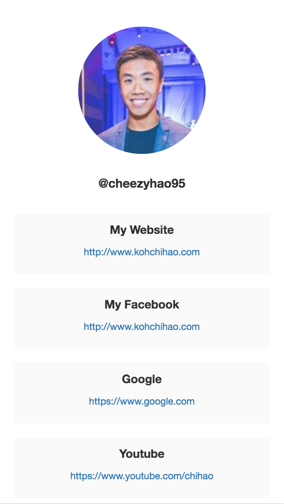

## MyLinks 

As an influencer, we have difficulties sharing multiple links on our Instagram pages. So we decided to build a website that is unique to each user that will link to more links.

## What it does 
A unique URL like www.mylinks.com/cheezyhao95 will be given to the user with their Instagram handle behind. This link will bring you to a webpage to see more links that the user wants the audience to see. We also have a Telegram bot that interacts with the website. The user can create more links on the website and bot.

## What technology was used to built

- [NodeJS] (https://nodejs.org/en/) for Backend 
- [Telegraf] (http://telegraf.js.org/#/) for Telegram Bot 
- [Pug] (https://pugjs.org/api/getting-started.html) for Frontend
- [Instagram API] (https://www.instagram.com/developer/)

## Who built this? 
- Marcus Koh Chi Hao (Y1S2 CS)
- Tan Jin Ying (Y1S2 CS)
- Daniel Khoo (Y1S2 CS)
- Keith Tan (Y1S2 CS)

## Screenshots 

